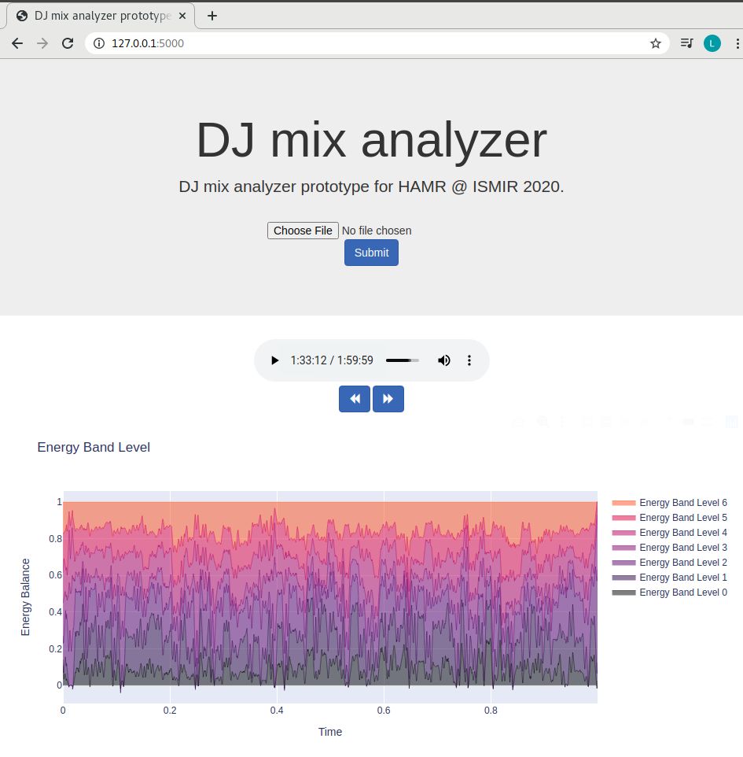

# DJ mix analysis tool for HAMR 2020

This is a tool to visualize the evolution of musical features throughout a DJ mix.

## How to run

```
export FLASK_APP=application.py
flask run
```

Then browse to [http://127.0.0.1:5000/](http://127.0.0.1:5000/).  
Upload the mix you want to visualize; note that this takes a while (a few minutes for a two-hour mix).
Results will be plotted in an interactive widget. Click on the visualization to skip to the relevant part of the mix.

This is what the app looks like:



---
Created by Raphaël Romero, Mickaël Zehren, Alex de Raadt and Len Vande Veire.
